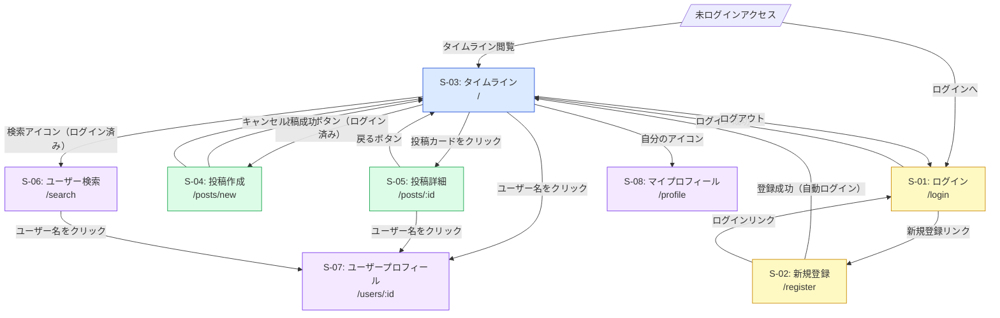

# 画面仕様

← [要件定義書に戻る](../要件定義書.md)

---

## 画面一覧

| # | 画面名 | パス | アクセス可能ユーザー |
|---|--------|------|---------------------|
| S-01 | ログイン画面 | `/login` | 未ログイン |
| S-02 | 新規登録画面 | `/register` | 未ログイン |
| S-03 | タイムライン画面 | `/` | 全ユーザー |
| S-04 | 投稿作成画面 | `/posts/new` | ログイン済み |
| S-05 | 投稿詳細画面 | `/posts/:id` | 全ユーザー |
| S-06 | ユーザー検索画面 | `/search` | ログイン済み |
| S-07 | ユーザープロフィール画面 | `/users/:id` | 全ユーザー |
| S-08 | マイプロフィール画面 | `/profile` | ログイン済み |

---

## S-01: ログイン画面 (`/login`)

```
┌─────────────────────────────────────────┐
│            RaiseTimeLine                 │
│                                          │
│  メールアドレス                           │
│  [                               ]       │
│                                          │
│  パスワード                               │
│  [                               ]       │
│                                          │
│          [ ログイン ]                     │
│                                          │
│  アカウントをお持ちでない方 → 新規登録      │
└─────────────────────────────────────────┘
```

| 要素 | 種別 | 備考 |
|------|------|------|
| メールアドレス入力欄 | Input (type=email) | 必須 |
| パスワード入力欄 | Input (type=password) | 必須・マスク表示 |
| ログインボタン | Button | フォーム送信 |
| 新規登録リンク | Link | `/register` へ遷移 |
| エラーメッセージ | 表示 | 認証失敗時に表示 |

---

## S-02: 新規登録画面 (`/register`)

```
┌─────────────────────────────────────────┐
│            新規登録                       │
│                                          │
│  ユーザー名                               │
│  [                               ]       │
│                                          │
│  メールアドレス                           │
│  [                               ]       │
│                                          │
│  パスワード                               │
│  [                               ]       │
│                                          │
│  パスワード確認                           │
│  [                               ]       │
│                                          │
│           [ 登録する ]                    │
│                                          │
│  すでにアカウントをお持ちの方 → ログイン    │
└─────────────────────────────────────────┘
```

---

## S-03: タイムライン画面 (`/`)

```
┌─────────────────────────────────────────────────────┐
│  RaiseTimeLine    [検索]  [新規投稿]  [👤 username ▼] │
├─────────────────────────────────────────────────────┤
│  [ ホーム ]  [ すべて ]                               │
├─────────────────────────────────────────────────────┤
│ ┌───────────────────────────────────────────────┐   │
│ │ 👤 username          2026-05-27 14:00          │   │
│ │                                                │   │
│ │  投稿本文テキストがここに表示されます。          │   │
│ │  [投稿画像（任意）]                             │   │
│ │                                                │   │
│ │  ♡ 12   💬 5                    [削除（自分のみ）]│   │
│ └───────────────────────────────────────────────┘   │
│ ┌───────────────────────────────────────────────┐   │
│ │  （投稿カード繰り返し）                         │   │
│ └───────────────────────────────────────────────┘   │
│              [ もっと見る ]                           │
└─────────────────────────────────────────────────────┘
```

**投稿カードの要素:**

| 要素 | 表示条件 | 備考 |
|------|----------|------|
| 投稿者アバター | 常時 | デフォルト画像あり |
| 投稿者ユーザー名 | 常時 | クリックで S-07 へ遷移 |
| 投稿日時 | 常時 | 相対表示（例: 3分前） |
| 投稿本文 | 常時 | 最大140文字 |
| 投稿画像 | 画像ありの場合のみ | - |
| いいねボタン＋数 | 常時 | ログイン済みのみ押下可能 |
| コメントアイコン＋数 | 常時 | クリックで S-05 へ遷移 |
| 削除ボタン | 自分の投稿のみ | - |

---

## S-04: 投稿作成画面 (`/posts/new`)

```
┌─────────────────────────────────────────┐
│            新規投稿                       │
│                                          │
│  [                               ]       │
│  [                               ]       │
│  [        本文入力エリア          ]       │
│                                          │
│                          0 / 140 文字    │
│                                          │
│  📷 画像を選択  [選択後はプレビュー表示]    │
│                                          │
│  [ キャンセル ]          [ 投稿する ]     │
└─────────────────────────────────────────┘
```

| 要素 | 種別 | 備考 |
|------|------|------|
| 本文入力欄 | Textarea | 必須・最大140文字 |
| 文字数カウンター | 表示 | リアルタイムで更新 |
| 画像選択ボタン | Button (file input) | 任意・jpg/png/gif |
| 画像プレビュー | 画像 | 選択後に表示 |
| 投稿ボタン | Button | 本文1文字以上で活性化 |
| キャンセルボタン | Button | タイムラインへ戻る |

---

## S-05: 投稿詳細画面 (`/posts/:id`)

```
┌─────────────────────────────────────────────────────┐
│  ← 戻る                                              │
├─────────────────────────────────────────────────────┤
│ 👤 username          2026-05-27 14:00                │
│                                                      │
│  投稿本文テキストがここに表示されます。               │
│  [投稿画像（任意・大きめ表示）]                       │
│                                                      │
│  ♡ 12                            [削除（自分のみ）]  │
├─────────────────────────────────────────────────────┤
│  コメント（5件）                                     │
├─────────────────────────────────────────────────────┤
│  [コメント入力欄（ログイン済みのみ表示）]  [ 投稿 ]   │
├─────────────────────────────────────────────────────┤
│ ┌───────────────────────────────────────────────┐   │
│ │ 👤 commenter   2026-05-27 14:05               │   │
│ │ コメント本文がここに表示されます。              │   │
│ │                              [削除（自分のみ）] │   │
│ └───────────────────────────────────────────────┘   │
└─────────────────────────────────────────────────────┘
```

---

## S-06: ユーザー検索画面 (`/search`)

```
┌─────────────────────────────────────────┐
│            ユーザー検索                   │
│                                          │
│  [  ユーザー名を入力  ]  [ 検索 ]         │
│                                          │
├─────────────────────────────────────────┤
│ ┌───────────────────────────────────┐   │
│ │ 👤  username                       │   │
│ │     @username                      │   │
│ │                    [ フォロー ]     │   │
│ └───────────────────────────────────┘   │
│ ┌───────────────────────────────────┐   │
│ │  （検索結果繰り返し）               │   │
│ └───────────────────────────────────┘   │
└─────────────────────────────────────────┘
```

---

## S-07: ユーザープロフィール画面 (`/users/:id`)

```
┌─────────────────────────────────────────────────────┐
│  👤（大きめアバター）  username                       │
│                        自己紹介文がここに表示されます。│
│                        フォロワー: 12  フォロー中: 5  │
│                        [ フォロー ] or [ フォロー中 ] │
├─────────────────────────────────────────────────────┤
│  このユーザーの投稿一覧（タイムライン形式）            │
└─────────────────────────────────────────────────────┘
```

---

## S-08: マイプロフィール画面 (`/profile`)

```
┌─────────────────────────────────────────┐
│            プロフィール編集               │
│                                          │
│  👤（アバター）  [ 画像を変更 ]            │
│                                          │
│  ユーザー名                               │
│  [  現在のユーザー名  ]                   │
│                                          │
│  自己紹介文                               │
│  [                               ]       │
│  [                               ]       │
│                               0 / 160 文字│
│                                          │
│  メールアドレス（変更不可）                │
│  user@example.com                        │
│                                          │
│  [ キャンセル ]          [ 保存する ]     │
└─────────────────────────────────────────┘
```

---

## 画面遷移図


