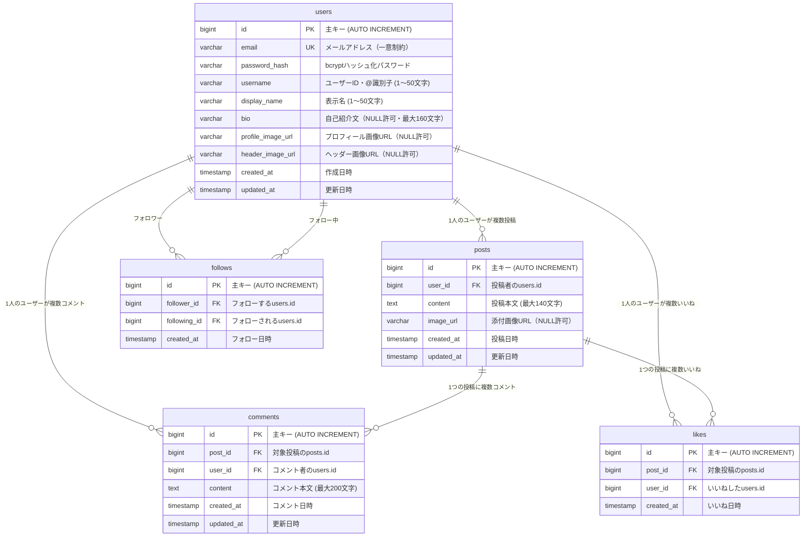

# データ設計

← [要件定義書に戻る](../要件定義書.md)

---

本アプリケーションはSpring Boot（JPA）を介してPostgreSQLにデータを保存する。
画像ファイルはAWS S3に保存し、URLのみDBに記録する。

---

## エンティティ定義



---

## テーブル定義

### users テーブル

| カラム名 | データ型 | NULL | 制約 | 説明 |
|----------|---------|------|------|------|
| `id` | `BIGINT` | NOT NULL | PK, AUTO INCREMENT | 主キー |
| `email` | `VARCHAR(255)` | NOT NULL | UNIQUE | メールアドレス |
| `password_hash` | `VARCHAR(255)` | NOT NULL | - | bcryptハッシュ |
| `username` | `VARCHAR(50)` | NOT NULL | - | ユーザーID（@の後に使われる識別子） |
| `display_name` | `VARCHAR(50)` | NOT NULL | DEFAULT '' | 表示名（プロフィールに表示される名前） |
| `bio` | `VARCHAR(160)` | NULL | - | 自己紹介文 |
| `profile_image_url` | `VARCHAR(500)` | NULL | - | プロフィール画像URL |
| `header_image_url` | `VARCHAR(500)` | NULL | - | ヘッダー画像URL |
| `created_at` | `TIMESTAMP` | NOT NULL | DEFAULT NOW() | 登録日時 |
| `updated_at` | `TIMESTAMP` | NOT NULL | DEFAULT NOW() | 最終更新日時 |

```sql
CREATE TABLE users (
    id                BIGSERIAL    PRIMARY KEY,
    email             VARCHAR(255) NOT NULL UNIQUE,
    password_hash     VARCHAR(255) NOT NULL,
    username          VARCHAR(50)  NOT NULL,
    display_name      VARCHAR(50)  NOT NULL DEFAULT '',
    bio               VARCHAR(160),
    profile_image_url VARCHAR(500),
    header_image_url  VARCHAR(500),
    created_at        TIMESTAMP    NOT NULL DEFAULT NOW(),
    updated_at        TIMESTAMP    NOT NULL DEFAULT NOW()
);
```

---

### posts テーブル

| カラム名 | データ型 | NULL | 制約 | 説明 |
|----------|---------|------|------|------|
| `id` | `BIGINT` | NOT NULL | PK, AUTO INCREMENT | 主キー |
| `user_id` | `BIGINT` | NOT NULL | FK → users.id | 投稿者 |
| `content` | `TEXT` | NOT NULL | CHECK(length ≤ 140) | 投稿本文 |
| `image_url` | `VARCHAR(500)` | NULL | - | 添付画像URL |
| `created_at` | `TIMESTAMP` | NOT NULL | DEFAULT NOW() | 投稿日時 |
| `updated_at` | `TIMESTAMP` | NOT NULL | DEFAULT NOW() | 最終更新日時 |

```sql
CREATE TABLE posts (
    id         BIGSERIAL    PRIMARY KEY,
    user_id    BIGINT       NOT NULL REFERENCES users(id) ON DELETE CASCADE,
    content    TEXT         NOT NULL CHECK (char_length(content) <= 140),
    image_url  VARCHAR(500),
    created_at TIMESTAMP    NOT NULL DEFAULT NOW(),
    updated_at TIMESTAMP    NOT NULL DEFAULT NOW()
);

CREATE INDEX idx_posts_user_id    ON posts(user_id);
CREATE INDEX idx_posts_created_at ON posts(created_at DESC);
```

---

### comments テーブル

| カラム名 | データ型 | NULL | 制約 | 説明 |
|----------|---------|------|------|------|
| `id` | `BIGINT` | NOT NULL | PK, AUTO INCREMENT | 主キー |
| `post_id` | `BIGINT` | NOT NULL | FK → posts.id | 対象投稿 |
| `user_id` | `BIGINT` | NOT NULL | FK → users.id | コメント者 |
| `content` | `TEXT` | NOT NULL | CHECK(length ≤ 200) | コメント本文 |
| `created_at` | `TIMESTAMP` | NOT NULL | DEFAULT NOW() | コメント日時 |
| `updated_at` | `TIMESTAMP` | NOT NULL | DEFAULT NOW() | 最終更新日時 |

```sql
CREATE TABLE comments (
    id         BIGSERIAL PRIMARY KEY,
    post_id    BIGINT    NOT NULL REFERENCES posts(id) ON DELETE CASCADE,
    user_id    BIGINT    NOT NULL REFERENCES users(id) ON DELETE CASCADE,
    content    TEXT      NOT NULL CHECK (char_length(content) <= 200),
    created_at TIMESTAMP NOT NULL DEFAULT NOW(),
    updated_at TIMESTAMP NOT NULL DEFAULT NOW()
);

CREATE INDEX idx_comments_post_id ON comments(post_id);
```

---

### likes テーブル

| カラム名 | データ型 | NULL | 制約 | 説明 |
|----------|---------|------|------|------|
| `id` | `BIGINT` | NOT NULL | PK, AUTO INCREMENT | 主キー |
| `post_id` | `BIGINT` | NOT NULL | FK → posts.id | 対象投稿 |
| `user_id` | `BIGINT` | NOT NULL | FK → users.id | いいねしたユーザー |
| `created_at` | `TIMESTAMP` | NOT NULL | DEFAULT NOW() | いいね日時 |

`(post_id, user_id)` に UNIQUE 制約（同一ユーザーが同一投稿に2回いいね不可）

```sql
CREATE TABLE likes (
    id         BIGSERIAL PRIMARY KEY,
    post_id    BIGINT    NOT NULL REFERENCES posts(id) ON DELETE CASCADE,
    user_id    BIGINT    NOT NULL REFERENCES users(id) ON DELETE CASCADE,
    created_at TIMESTAMP NOT NULL DEFAULT NOW(),
    CONSTRAINT uq_likes_post_user UNIQUE (post_id, user_id)
);
```

---

### follows テーブル

| カラム名 | データ型 | NULL | 制約 | 説明 |
|----------|---------|------|------|------|
| `id` | `BIGINT` | NOT NULL | PK, AUTO INCREMENT | 主キー |
| `follower_id` | `BIGINT` | NOT NULL | FK → users.id | フォローするユーザー |
| `following_id` | `BIGINT` | NOT NULL | FK → users.id | フォローされるユーザー |
| `created_at` | `TIMESTAMP` | NOT NULL | DEFAULT NOW() | フォロー日時 |

`(follower_id, following_id)` に UNIQUE 制約 + `follower_id ≠ following_id` チェック

```sql
CREATE TABLE follows (
    id           BIGSERIAL PRIMARY KEY,
    follower_id  BIGINT    NOT NULL REFERENCES users(id) ON DELETE CASCADE,
    following_id BIGINT    NOT NULL REFERENCES users(id) ON DELETE CASCADE,
    created_at   TIMESTAMP NOT NULL DEFAULT NOW(),
    CONSTRAINT uq_follows            UNIQUE (follower_id, following_id),
    CONSTRAINT chk_no_self_follow    CHECK  (follower_id <> following_id)
);

CREATE INDEX idx_follows_follower_id  ON follows(follower_id);
CREATE INDEX idx_follows_following_id ON follows(following_id);
```

---

## リレーションシップまとめ

| 関係 | カーディナリティ | カスケード |
|------|-----------------|-----------|
| users → posts | 1対多 | ユーザー削除時に投稿も削除 |
| users → comments | 1対多 | ユーザー削除時にコメントも削除 |
| users → likes | 1対多 | ユーザー削除時にいいねも削除 |
| users → follows（follower） | 1対多 | ユーザー削除時にフォロー関係も削除 |
| users → follows（following） | 1対多 | ユーザー削除時にフォロー関係も削除 |
| posts → comments | 1対多 | 投稿削除時にコメントも削除 |
| posts → likes | 1対多 | 投稿削除時にいいねも削除 |

---

## よく使うクエリ例

### タイムライン（すべて）— いいね数・コメント数付き

```sql
SELECT
    p.id,
    p.content,
    p.image_url,
    p.created_at,
    u.username,
    u.profile_image_url,
    COUNT(DISTINCT l.id) AS like_count,
    COUNT(DISTINCT c.id) AS comment_count
FROM posts p
JOIN users u ON p.user_id = u.id
LEFT JOIN likes    l ON p.id = l.post_id
LEFT JOIN comments c ON p.id = c.post_id
GROUP BY p.id, u.id
ORDER BY p.created_at DESC
LIMIT 20 OFFSET 0;
```

### タイムライン（ホーム）— 自分 + フォロー中ユーザーの投稿

```sql
SELECT
    p.id,
    p.content,
    p.image_url,
    p.created_at,
    u.username,
    u.profile_image_url,
    COUNT(DISTINCT l.id) AS like_count,
    COUNT(DISTINCT c.id) AS comment_count
FROM posts p
JOIN users u ON p.user_id = u.id
LEFT JOIN likes    l ON p.id = l.post_id
LEFT JOIN comments c ON p.id = c.post_id
WHERE p.user_id = :currentUserId
   OR p.user_id IN (SELECT following_id FROM follows WHERE follower_id = :currentUserId)
GROUP BY p.id, u.id
ORDER BY p.created_at DESC
LIMIT 20 OFFSET 0;
```

### 自分がいいねしているか判定

```sql
SELECT EXISTS (
    SELECT 1 FROM likes
    WHERE post_id = :postId AND user_id = :currentUserId
) AS is_liked;
```

### ユーザー名で検索（部分一致）

```sql
SELECT id, username, profile_image_url
FROM users
WHERE username ILIKE '%' || :keyword || '%'
  AND id <> :currentUserId
LIMIT 20;
```

### フォロー付与 / 取り消し

```sql
-- フォロー（重複時は何もしない）
INSERT INTO follows (follower_id, following_id) VALUES (:followerId, :followingId)
ON CONFLICT (follower_id, following_id) DO NOTHING;

-- アンフォロー
DELETE FROM follows WHERE follower_id = :followerId AND following_id = :followingId;
```
